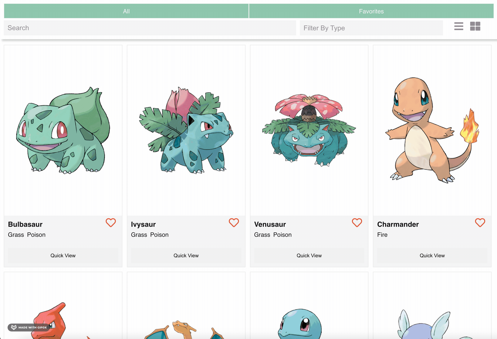
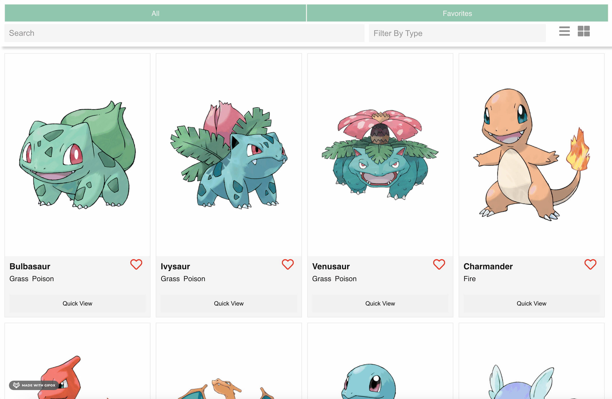

# Challenges Coding Exercise Frontend

### Problem Statement

Build a small application that should be able to: 

- Search for Pokemon by text through use of a search bar.
- Filter Pokemon by type using a dropdown.
- Add and remove a Pokemon to and from your Favorites by clicking the heart icon.
- Use tabs to switch between `All` Pokemon and `Favorite` Pokemon views.
- Change the view from either a grid or list.
- View Pokemon details using a `/:name` route.
- Clicking on a Pokemon image or name should navigate to the above route to view the Pokemon details.
- On the Pokemon details page, have a speaker icon that, when clicked, plays the sound of that Pokemon.

In addition to the above features, below are some optional features that we'd love to see at least one of:
- Infinitely scrolled or paginated list to handle on-demand data-fetching for the long list of Pokemon.
- Add a quick view button on the Pokemon list items that shows a modal with more information of the Pokemon.
- Add toast notifications to show success or error messages when adding or removing a Pokemon to and from your Favorites.

### Technologies Used

The technologies used in this exxercise include:

- React.
- React Router.
- Styled Components.


### Running Pokemon Take Home Locally

#### Run the frontend
```
$ cd pokemon-take-home
$ npm install
$ npm start
```

Open your browser and navigate to:

```
  http://localhost:3000/
```

###  Problem Implementation


Considering that the most valued technology stack for this exercise required using [React](https://github.com/facebook/react), I pulled out the `frontend` part of the provided boilerplate and served up the `pokemons.json` file from the root of the `src` folder. 

#### Features

##### 1. Search for Pokemon by text using a search bar

The functionality for the Search Bar tracks each change whenever the user types into the input field. The useState Hook declares a state variable and returns a pair of values: the current state and a function that updates the state whenever there is a change in the input field.


##### 2. Filter Pokemon by type using a dropdown



##### 3. Add and remove a Pokemon to and from your Favorites by clicking the heart icon.


##### 4. Use tabs to switch between `All` Pokemon and `Favorite` Pokemon views.


##### 5. Change the view from either a grid or list.


##### 6. Clicking on a Pokemon image or name should navigate to the `/:name` route to view the Pokemon details.


##### 7. On the Pokemon details page, the speaker icon plays the sound of that Pokemon when clicked.

The `public` folder was useful as a workaround to serving up the audio files from a server. Moving the `sounds/` folder into the `public` folder  made these .mp3 files accessible accessible via the `process.env.PUBLIC_URL` prefix. The sound variable was initialized in the `CharacterDetailPage` component:

```js
let sound = process.env.PUBLIC_URL + `/assets/sounds/${parseInt(currentCharacter.id, 10)}.mp3`;
```

The sound URL is passed into the Audio constructor which creates and returns a new HTMLAudioElement. Once the audio object instance is created and the `.mp3` file is loaded, the button takes an onClick handler that calls the `play()` method.

```js
  <button className="character-audio" onClick={() => audio.play()}>
    ...
  </button>
```


#### Bonus Feature

##### 8. Add a quick view button on the Pokemon list items that shows a modal with more information of the Pokemon.

Initially, the modal implementation had a simple show and hide toggle. As the feature developed, the modal needed to present dynamic data based on the Pokemon character that was clicked. The `showModal` and `modalCharacter` states were declared at the `App` level with their respective functions called within a handleClick that gets passed down to the Quick View `button` in the `CharacterItem` component where the event fires. 

```js
  <Modal 
    modalCharacter={modalCharacter}
    onClose={() => setShowModal(false)} 
    showModal={showModal}/>
```

```js
<button 
  className="quick-view-btn"
  onClick={() => handleModalClick(character)}
  >Quick View</button>
```

